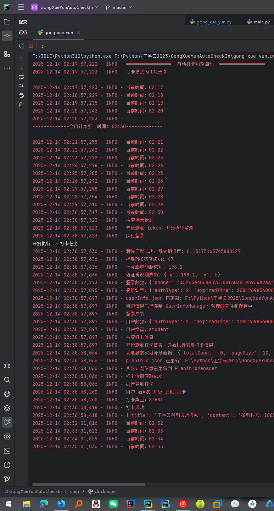

# GongXueYunAutoCheckIn-UI（工学云自动打卡脚本UI版本）

GongXueYunAutoCheckIn 工学云自动打卡，采用新接口，更安全，支持多用户、自定义位置信息、保持登录状态、每日打卡检查、打卡位置浮动、消息推送，免服务器运行

修改这个项目的初衷是因为我自己需要使用，23年写过一版，但是工学云服务接口更新了，新增了滑块验证，除了开发者预留测试接口，只能训练视觉模型去模拟我们滑动，去年没有使用需求就没管，今年需要用到，发现请求还新增了数据加密，找了好久终于在github上找到了这个项目，使用的新接口并且解决了滑块验证和数据加密的问题（膜拜大佬），因此重新修改这个项目。(
原作者已停止维护)

[//]: # (等到实习结束，这个项目也将会停止更新。天下没有不散的筵席，有缘再会。最后建议可以迁移到下面这个平台，价格算是全网最良心的了)
原作者有开发更多功能，但是我只需要使用打卡功能，故而修改了项目，需要体验更多功能，例如带图打卡、周报月报等，请访问原作者连接

原项目作者链接：https://github.com/Rockytkg/AutoMoGuDingCheckIn?tab=readme-ov-file

改了两个版本：
1.使用脚本运行，可以定时，异地打卡，但是电脑不能关机

代码版本项目链接如下：https://gitee.com/polaris_lx/GongXueYunAutoCheckIn_CodeVersion

2.使用UI界面使用，可以实现异地打卡，但是属于即时打卡，需要用户自己手动打卡

UI版本项目链接如下：https://gitee.com/polaris_lx/GongXueYunAutoCheckIn_UIVersion


---

## 项目概述

GongXueYunAutoCheckIn 旨在：

- 自动化工学云应用中的签到过程。

---

## 功能列表

- [x] 自动签到
- [x] 消息推送功能
- [x] 多用户支持
- [X] 打卡位置浮动

---

## 运行效果图

<div>
邮箱通知
<br>


运行日志截图
<br>

</div>

---

### 1. Github 工作流（免服务器部署）

参见 [Wiki](https://github.com/Rockytkg/AutoMoGuDingCheckIn/wiki/Github-%E5%B7%A5%E4%BD%9C%E6%B5%81%E9%83%A8%E7%BD%B2)

**切记不要将配置文件上传到公开仓库，否则会造成信息泄露。请使用环境变量！！！，已经泄露请立刻修改工学云密码！！！**

### 2. 本地运行

#### 环境

- Python 3.10+
- pip（Python 包管理器）

#### 安装

1. 克隆代码库：

   ```bash
   git https://gitee.com/polaris_lx/GongXueYunAutoCheckIn_Code.git
   cd GongXueYunAutoCheckIn_Code
   ```

2. 按照下面要求添加配置文件
3. 执行（linux 系统，windows 需要自行配置计划任务程序）

   ```bash
   chmod +x setup.sh
   bash setup.sh
   ```

   按照脚本提示设置定时任务并执行

#### 配置

1. 在根目录，根据下表修改 config.json 文件中的配置（每个文件就是一个用户）

<!-- markdownlint-disable MD033 -->
<table>
    <tr>
        <th>配置项</th>
        <th>字段</th>
        <th>说明</th>
        <th>示例</th>
    </tr>
    <!-- 用户信息 -->
    <tr>
        <td rowspan="2">用户信息</td>
        <td>phone</td>
        <td>工学云登录手机号。</td>
        <td>18800000000</td>
    </tr>
    <tr>
        <td>password</td>
        <td>工学云登录密码。</td>
        <td>your_password</td>
    </tr>
    <!-- 打卡设置 -->
    <tr>
        <td rowspan="11">打卡设置</td>
        <td>mode</td>
        <td>打卡模式：<code>everyday</code> 每天；<code>customize</code> 自定义周几；<code>weekday</code> 法定工作日。</td>
        <td>weekday</td>
    </tr>
    <tr>
        <td>location.address</td>
        <td>打卡地点详细地址。</td>
        <td>四川省 · 成都市 · 高新区 · 在科创十一街附近</td>
    </tr>
    <tr>
        <td>location.latitude</td>
        <td>打卡纬度。</td>
        <td>30.559922</td>
    </tr>
    <tr>
        <td>location.longitude</td>
        <td>打卡经度。</td>
        <td>104.093023</td>
    </tr>
    <tr>
        <td>location.province</td>
        <td>省份。</td>
        <td>四川省</td>
    </tr>
    <tr>
        <td>location.city</td>
        <td>城市。</td>
        <td>成都市</td>
    </tr>
    <tr>
        <td>location.area</td>
        <td>区域。</td>
        <td>高新区</td>
    </tr>
    <tr>
        <td>holidaysClockIn</td>
        <td>节假日是否也打卡。（ 打`休息/节假日`卡 ）</td>
        <td>false</td>
    </tr>
    <tr>
        <td>customDays</td>
        <td>自定义周几打卡（1=周一，7=周日）。</td>
        <td>[1,2,3,4,5]</td>
    </tr>
    <tr>
        <td>time.start</td>
        <td>固定打卡时间（小时:分钟）</td>
        <td>08:45</td>
    </tr>
    <tr>
        <td>time.float</td>
        <td>浮动范围（分钟）。</td>
        <td>10</td>
    </tr>
    <!-- SMTP 推送 -->
    <tr>
        <td rowspan="7">SMTP 推送通知</td>
        <td>enable</td>
        <td>是否启用邮件推送。</td>
        <td>true</td>
    </tr>
    <tr>
        <td>host</td>
        <td>SMTP 邮件服务器地址。</td>
        <td>smtp.163.com</td>
    </tr>
    <tr>
        <td>port</td>
        <td>SMTP 端口，通常 465。</td>
        <td>465</td>
    </tr>
    <tr>
        <td>username</td>
        <td>发件邮箱账号。</td>
        <td>sender@163.com</td>
    </tr>
    <tr>
        <td>password</td>
        <td>SMTP 授权码或密码。</td>
        <td>smtp_password</td>
    </tr>
    <tr>
        <td>from/to</td>
        <td>发件人名称</td>
        <td>极星科技研发部助理机器人零号</td>
    </tr>
    <tr>
        <td>from/to</td>
        <td>收件人列表</td>
        <td>["1880000000@163.com","18800000000@qq.com"]</td>
    </tr>
    <!-- 设备信息 -->
    <tr>
        <td rowspan="1">设备信息</td>
        <td>device</td>
        <td>设备信息</td>
        <td>{brand: Xiaomi 17Pro, systemVersion: 16, Platform: Android, isPhysicalDevice: true, incremental: 25098PN5AC}</td>
</table>

##### 示例 JSON 配置

```json
{
   "config": {
      "user": {
         "phone": "18800000000",
         "password": "123456"
      },
      "clockIn": {
         "mode": "weekday",
         "location": {
            "address": "四川省 · 成都市 · 高新区 · 在科创十一街附近",
            "latitude": "30.559922",
            "longitude": "104.093023",
            "province": "四川省",
            "city": "成都市",
            "area": "高新区"
         },
         "holidaysClockIn": false,
         "customDays": [
            1,
            2,
            3,
            4,
            5
         ],
         "time": {
            "start": "08:45",
            "float": 10
         }
      },
      "smtp": {
         "enable": true,
         "host": "smtp.163.com",
         "port": 465,
         "username": "发件人邮箱",
         "password": "smtp密码",
         "from": "极星科技研发部助理机器人零号",
         "to": [
            "1880000000@163.com",
            "18800000000@qq.com"
         ]
      },
      "device": "{brand: Xiaomi 17Pro, systemVersion: 16, Platform: Android, isPhysicalDevice: true, incremental: 25098PN5AC}"
   }
}
```

##### 消息推送

支持：

- SMTP

#### 手动运行

```bash
python gong_xue_yun.py
```

## 🆕 功能使用指南

项目新增了两个重要功能，让您的使用体验更加便捷和智能。

### 1. 智能日志管理 📝

程序可以更好地追踪操作记录，让您清楚地知道执行情况。

#### 💡 这对您意味着什么？

- **清晰标识**：每个用户的日志都有专属标签，再也不用担心多个账号混淆
- **问题追踪**：出现问题时，可以快速定位是哪个账号出了状况
- **执行状态**：实时了解每个账号的打卡、报告提交状态

#### 📋 日志示例

当您运行程序时，会看到类似这样的日志：

```
2025-12-14 02:17:57,222 - INFO - ════════════════  自动打卡功能启动  ════════════════
2025-12-14 02:17:57,223 - INFO - 打卡模式为【每天】

2025-12-14 02:17:57,223 - INFO - 当前时间：02:17
2025-12-14 02:18:57,229 - INFO - 当前时间：02:18
2025-12-14 02:19:57,235 - INFO - 当前时间：02:19
2025-12-14 02:20:57,242 - INFO - 当前时间：02:20
```


### 2. 自动定时执行 ⏰

**重磅功能！** 不用每天手动运行打卡程序

#### 🎯 功能亮点

- **全自动运行**：设置好后完全无需人工干预
- **智能时间**：每天自动在上班和下班时间执行打卡
- **防检测设计**：每次执行时间都有随机偏移，避免被系统识别为机器操作
- **稳定可靠**：支持长期运行，自动处理日期变更

#### 📊 运行效果

启动后，您会看到这样的提示：

```
2025-12-14 02:17:57,222 - INFO - ════════════════  自动打卡功能启动  ════════════════
2025-12-14 02:17:57,223 - INFO - 打卡模式为【每天】

2025-12-14 02:17:57,223 - INFO - 当前时间：02:17
2025-12-14 02:18:57,229 - INFO - 当前时间：02:18
2025-12-14 02:19:57,235 - INFO - 当前时间：02:19
2025-12-14 02:20:57,242 - INFO - 当前时间：02:20
2025-12-14 02:20:57,253 - INFO - 
-------------今日计划打卡时间: 02:30-------------

2025-12-14 02:21:57,255 - INFO - 当前时间：02:21
2025-12-14 02:22:57,262 - INFO - 当前时间：02:22
```

这表示：

- 今天上午会在 9:07 执行打卡（原定 02:25 + 5分钟随机偏移）

### 3. 自定义执行时间 ⚙️

默认的执行时间是上午8:00，但您可以根据自己的需求轻松修改。

#### 🛠️ 快速修改教程

**步骤1：打开配置文件**

使用任意文本编辑器（如记事本、VS Code）打开 `config.json` 文件。

**步骤2：找到配置区域**

在文件中找到这几行：

```json
{
  "time": {
    "start": "08:45",
    "float": 10
  }
}
```

#### ⚠️ 重要提醒

- **时间格式**：必须使用 24小时制，格式为 "HH:MM"
- **合理时间**：选择符合常理的上下班时间
- **适度偏移**：建议保持 3-10 分钟的随机偏移
- **测试验证**：修改后先观察一天，确认时间合适

### 4. 实用操作技巧 💡

#### 🖥️ Windows 用户：后台运行

想让程序在后台悄悄运行，不影响您使用电脑？

```powershell
# 隐藏窗口运行，完全后台执行
Start-Process python -ArgumentList "gong_xue_yun.py" -WindowStyle Hidden
```

#### ⏹️ 停止自动执行

需要暂停自动打卡时，只需按 `Ctrl + C` 即可安全退出。

#### 📱 配合消息推送

建议开启消息推送功能，这样即使程序在后台运行，您也能及时收到打卡成功的通知。

### 5. 常见使用问题 ❓

#### 问：自动定时器启动失败怎么办？

**答：** 请先确认：

1. 手动运行 `python main.py` 是否正常
2. 配置文件是否正确设置
3. Python 环境是否安装完整

#### 问：时间不准确怎么办？

**答：** 检查您的电脑系统时间是否正确，程序会基于系统时间执行。

#### 问：程序会一直运行吗？

**答：** 是的，一旦启动定时器，程序会持续运行，每天自动执行打卡任务，直到您手动停止。

### 6. 升级使用建议 ⬆️

#### 🔄 从手动到自动

如果您之前一直手动运行 `python main.py`：

1. **先测试**：运行一次 `python gong_xue_yun.py` 确认正常
2. **观察一天**：让程序自动运行一天，确认执行时间合适
3. **放心使用**：确认无误后就可以完全依赖自动执行了

#### ✅ 兼容性保证

- 所有现有配置继续有效，无需修改
- 仍然可以随时手动运行 `python main.py`
- 自动定时功能是额外增加的，不影响原有使用方式

---

💡 **温馨提示**：建议初次使用时先观察几天，确认执行时间和效果符合预期后再长期使用。有任何问题都可以随时停止并手动执行。

